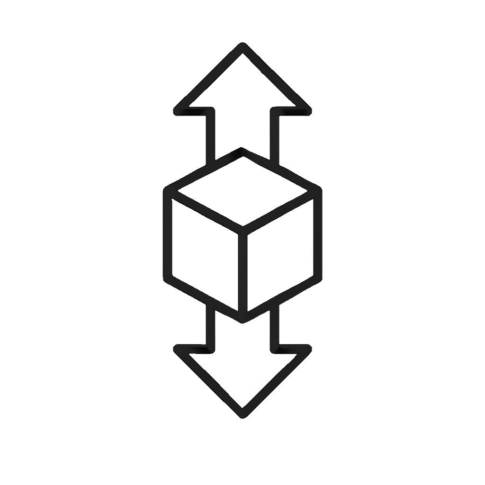

  

# EasySor 🛠️

**EasySor** is a Laravel-based web application designed to streamline the operations of elevator service companies. It helps manage customers, contracts, maintenance services, and repairs — all in one place.

---

## 🚀 Features

-   🧑‍💼 Customer Management
-   📄 Contract Tracking
-   🔧 Maintenance & Repair Logging
-   💰 Payment Recording for each service
-   📅 Periodic Service Scheduling
-   👥 Role-Based Access (Admin / Staff)
-   📱 Responsive Design with Tailwind CSS

---

## 👥 Roles

-   Admin: Full access to manage users, customers, and services.
-   Staff: Can view assigned tasks, record services, and update progress.

---

## 🛠️ Tech Stack

-   **Backend:** Laravel 12, PHP 8+
-   **Frontend:** Blade templates + Tailwind CSS
-   **Auth:** Laravel Breeze
-   **Database:** MySQL
